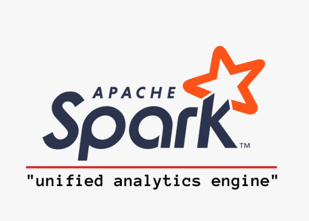

<!DOCTYPE html>
<html lang="en">
<head>
  <meta charset="UTF-8">
  <meta name="viewport" content="width=device-width, initial-scale=1.0">
  <meta name="description" content="GitHub profile in blue color">
  <meta name="keywords" content="Full Stack Developer, GitHub Stats, GitHub Profile, JavaScript, TypeScript, React, Nodejs, Scala, Apache Spark, Python, Java, PHP, PostgreSQL, MySQL, MongoDB">

  <title>Federico Pfund's GitHub Profile</title>

 
</head>
<body>
  

  

     
    
    
  

   
  

   

  

    <strong>Frameworks con los que trabajo:</strong>
     
     
    
    
    
    
    
    
    
    
    
    
  

   
   

   

  
 
    

      
    

  

  
</body>
</html>
