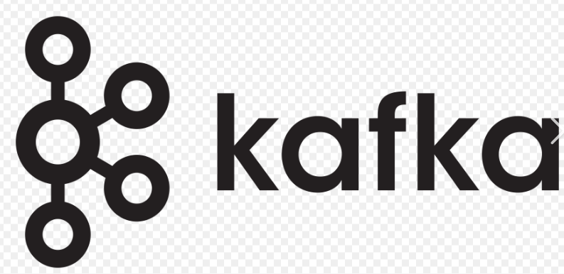
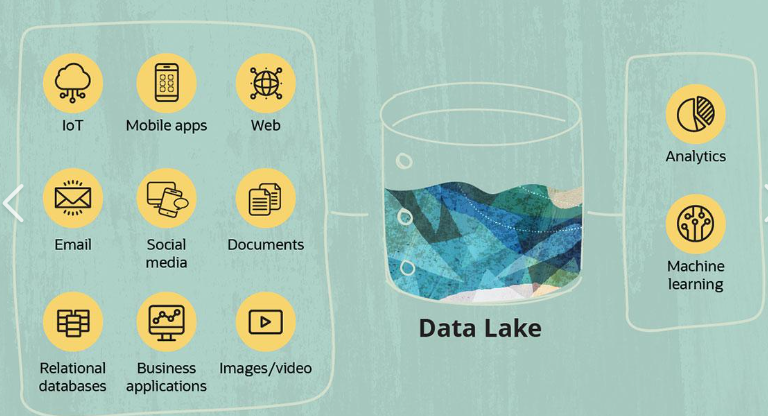

<meta name="description" content="GitHub profile in blue color">
<meta name="keywords" content="Full Stack Developer, GitHub Stats, GitHub Profile, JavaScript, TypeScript, React, Nodejs,Scala, Apahe Spark,Python, Java, PHP, PostgreSQL, MySQL, MongoDB"/>

  

   
  
  

 
   
 
 
  

  

    
    
    
     
    
    
      
    
    
    
     
    
       
    
    
     
  

 
 
  

 
  

    
  

 

 
  

    
  

 